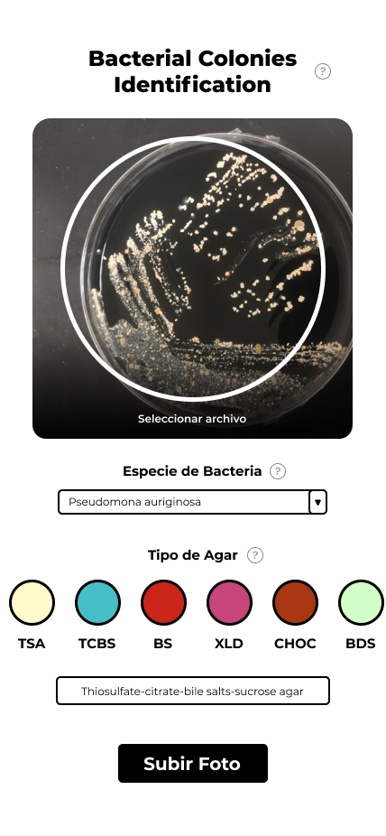

# ICBML-data-collection

This is a personal 🦠 Microbiology project that consists on a web application to collect images for the dataset of ICBML (Bacterial Colonies Identification with Machine Learning 🤖).

The image, along with its classification (agar, bacteria and specie) gets uploaded to a database, that then will be used to train a Tensorflow image classification model to recognize bacteria colonies based on its morphology, biochemistry tests and symptoms.

## How to use?
1. Take an image or choose a file (Make sure that the medium is centered in the photo)
2. Select the bacteria genus (You can choose one from the list or write it yourself)
3. If you know the species, feel free to put it in as well 😁! (e.g. Staphylococcus **aureus**)

*If you don't know it, don't worry, it will be classified as SPP (Species Plural)*

4. Select the medium in wich the colony of the photo is growing on (If it doesn't appear on the options, you can write it)

13 agar types,
40 genus,
41 species

